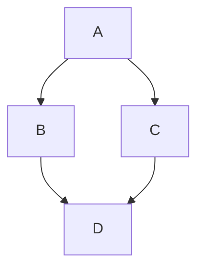
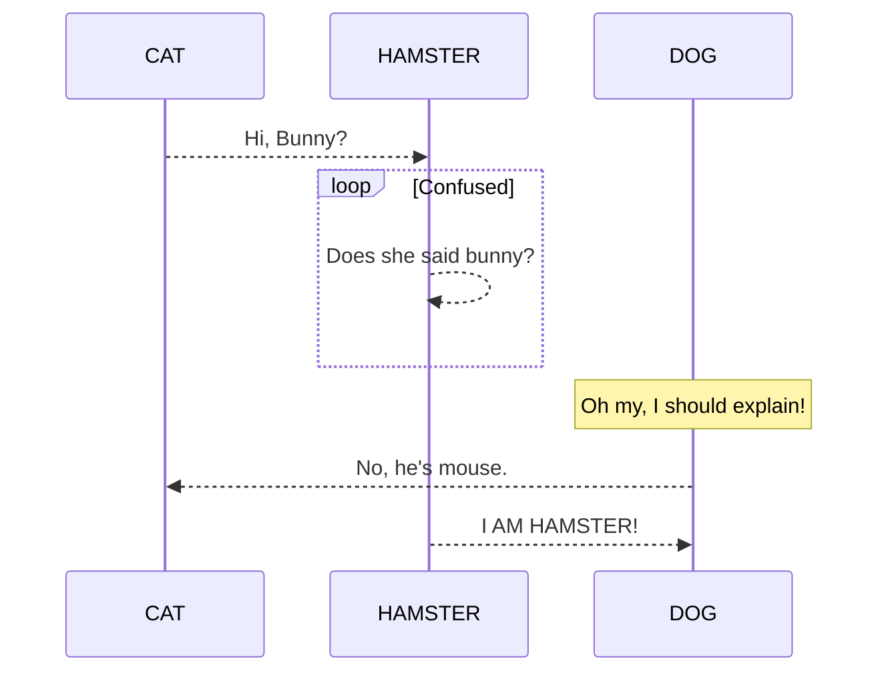

## Diagram
다이어그램 그리기

### Mermaid를 이용한 다이어그램

#### TD Graph
`graph TD`를 이용한 다이어그램

```mermaid
graph TD;
    A-->B;
    A-->C;
    B-->D;
    C-->D;
```

#### Sequence
`sequenceDiagram`를 이용한 다어이그램

```mermaid
sequenceDiagram;
    participant CAT
    participant HAMSTER
    participant DOG
    CAT-->>HAMSTER: Hi, Bunny?
    loop Confused
        HAMSTER-->>HAMSTER: Does she said bunny?
    end
    Note over DOG: Oh my, I should explain!
    DOG-->>CAT: No, he's mouse.
    HAMSTER-->>DOG: I AM HAMSTER!
```