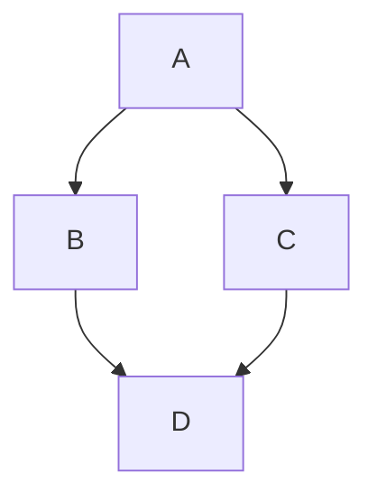
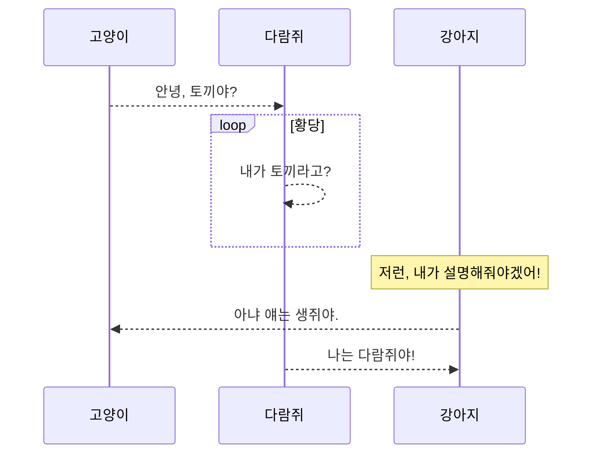

## 다이어그램 그리기
다이어그램 그리기

### Mermaid를 이용한 다이어그램

#### TD 그래프
`graph TD`를 이용한 다이어그램

```mermaid
graph TD;
    A-->B;
    A-->C;
    B-->D;
    C-->D;
```

#### 시퀀스
`sequenceDiagram`를 이용한 다어이그램

```mermaid
sequenceDiagram;
    participant 고양이
    participant 다람쥐
    participant 강아지
    고양이-->>다람쥐: 안녕, 토끼야?
    loop 황당
        다람쥐-->>다람쥐: 내가 토끼라고?
    end
    Note over 강아지: 저런, 내가 설명해줘야겠어!
    강아지-->>고양이: 아냐 얘는 생쥐야.
    다람쥐-->>강아지: 나는 다람쥐야!
```